# ✈️ Smart Travel RD

> **Aplicación móvil turística desarrollada con Ionic, Angular y Capacitor para descubrir los principales destinos de la República Dominicana.**

---

## 📱 Descripción

**Smart Travel RD** es una aplicación móvil desarrollada como proyecto final de la asignatura **Programación de Dispositivos Móviles**.

Su objetivo es facilitar la exploración de destinos turísticos de la República Dominicana mediante una interfaz moderna, integrando geolocalización, mapas interactivos, autenticación de usuarios, consumo de servicios web, herramientas multimedia y funcionalidades nativas del dispositivo móvil.

La aplicación fue desarrollada utilizando **Ionic Framework**, **Angular**, **Capacitor** y **Firebase Authentication**, permitiendo su ejecución tanto en navegador como en dispositivos Android.

---

# ✨ Funcionalidades

- ✅ Registro de usuarios
- ✅ Inicio de sesión con Firebase
- ✅ Inicio de sesión mediante Google
- ✅ Perfil del usuario
- ✅ Consulta de destinos turísticos
- ✅ Consumo de API REST
- ✅ Geolocalización GPS
- ✅ Mapa interactivo con Leaflet
- ✅ Detección del estado de conexión
- ✅ Cámara del dispositivo
- ✅ Selección de imágenes desde la galería
- ✅ Escáner de códigos QR
- ✅ Reproductor de audioguías
- ✅ Tema Claro / Oscuro / Automático
- ✅ Información y soporte
- ✅ Funcionamiento en Web y Android

---

# 🛠 Tecnologías utilizadas

- Ionic Framework
- Angular
- TypeScript
- Capacitor
- Firebase Authentication
- Leaflet
- OpenStreetMap
- PHP
- API REST
- RxJS
- HTML5 Audio API
- Android Studio
- Laragon
- ngrok
- Git
- GitHub

---

# 📂 Estructura del proyecto

```
src/
│
├── app/
│   ├── auth/
│   ├── models/
│   ├── services/
│   ├── tab1/
│   ├── tab2/
│   ├── tab3/
│   ├── tab4/
│   ├── tab5/
│   └── tabs/
│
├── assets/
├── environments/
└── theme/

android/
```

---

# 🏗 Arquitectura

La aplicación utiliza una arquitectura basada en componentes y servicios.

```
Usuario
      │
      ▼
Pantallas Ionic
      │
      ▼
Servicios Angular
      │
      ├──────── Firebase Authentication
      │
      ├──────── API REST (PHP)
      │
      ├──────── Leaflet
      │
      ├──────── Cámara
      │
      ├──────── GPS
      │
      ├──────── QR Scanner
      │
      └──────── Audio Guide
```

---

# 🌍 API REST

La aplicación consume una API desarrollada en PHP.

Endpoint principal:

```
GET /smart-travel-api/api/places.php
```

Durante el desarrollo la API fue publicada temporalmente utilizando **ngrok** para permitir pruebas desde dispositivos Android.

---

# 🔐 Autenticación

La autenticación fue implementada mediante **Firebase Authentication**, permitiendo:

- Registro de usuarios
- Inicio de sesión
- Inicio de sesión con Google
- Persistencia de sesión
- Cierre de sesión

---

# 📷 Funcionalidades nativas

La aplicación integra diferentes capacidades del dispositivo móvil:

- Cámara
- Galería
- Geolocalización
- Estado de red
- Escáner QR
- Reproducción de audio

---

# 📱 Capturas de la aplicación

## Inicio de sesión

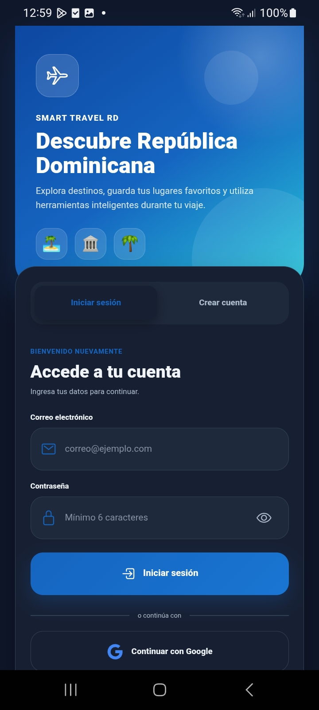

---

## Registro

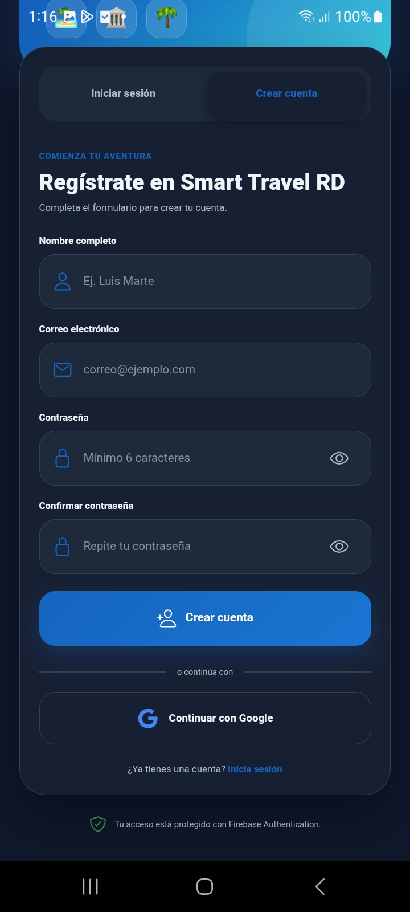

---

## Pantalla principal

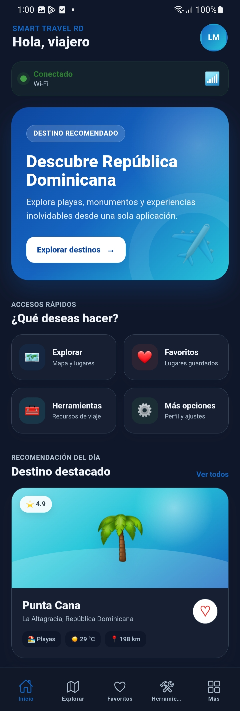

---

## Explorar destinos

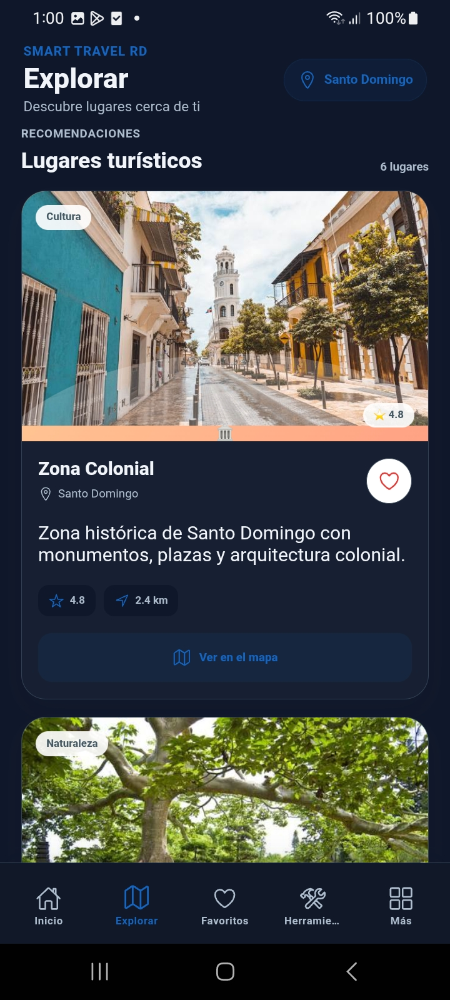

---

## Mapa interactivo

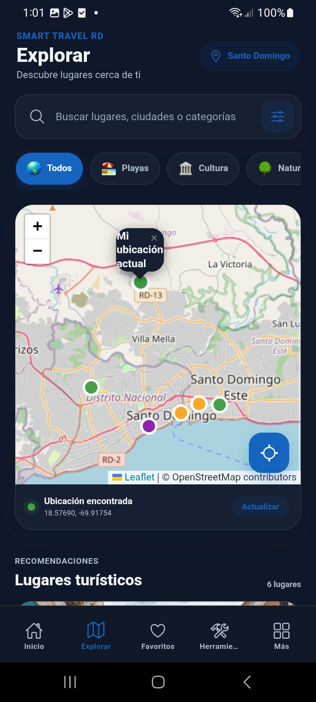

---

## Herramientas

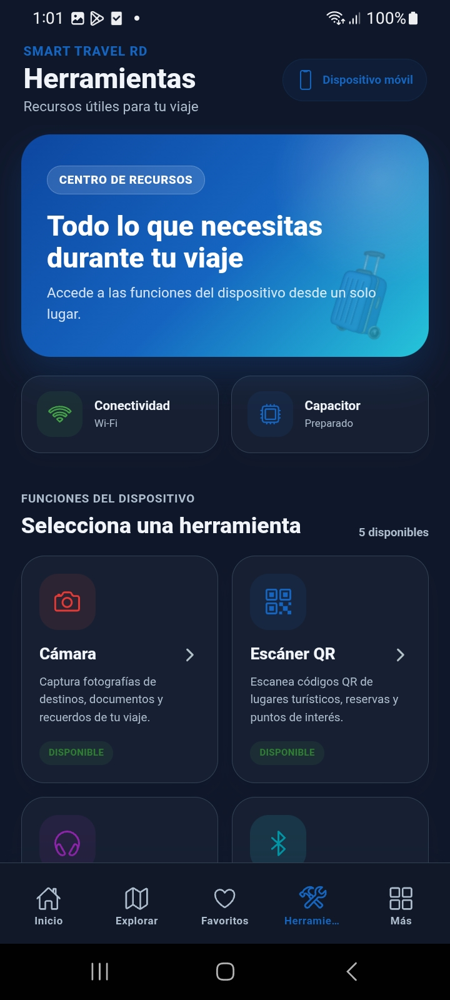

---

## Cámara

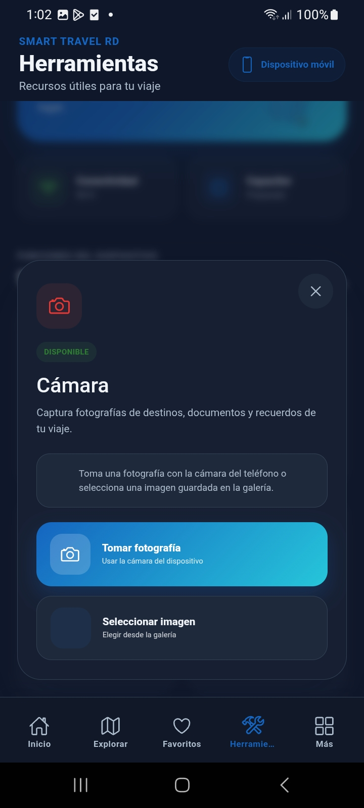

---

## Escáner QR

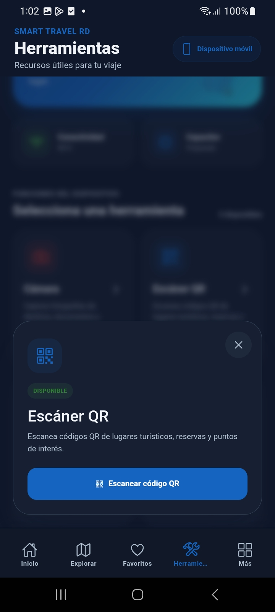

---

## Audioguía

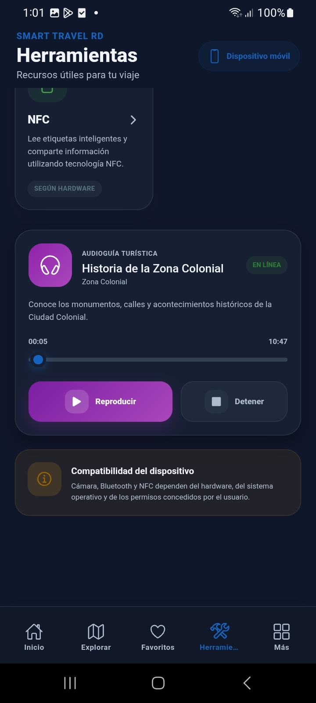

---

## Perfil

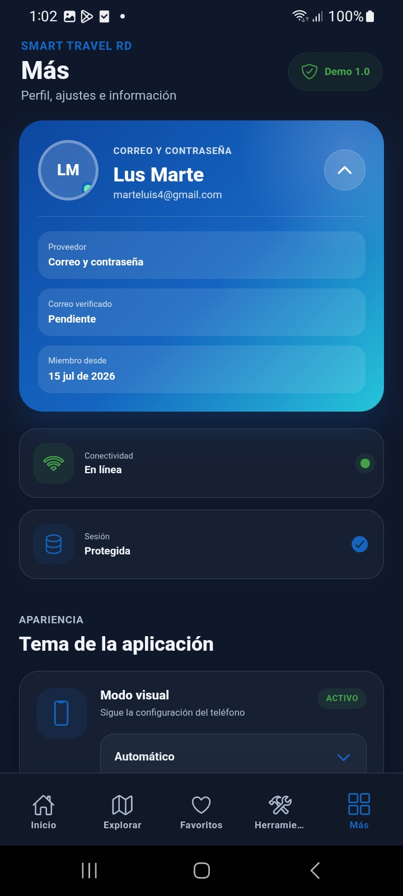

---

## Tema oscuro

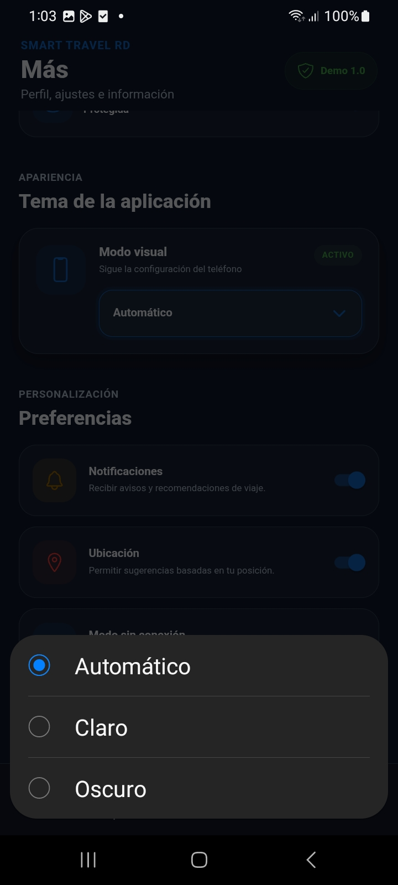

---

# ⚙ Instalación

Clonar el proyecto:

```bash
git clone https://github.com/202100857-art/smart-travel-rd.git
```

Entrar al proyecto:

```bash
cd smart-travel-rd
```

Instalar dependencias:

```bash
npm install
```

Ejecutar en navegador:

```bash
ionic serve
```

---

# 🤖 Ejecutar en Android

Construir la aplicación:

```bash
ionic build
```

Sincronizar Capacitor:

```bash
npx cap sync android
```

Abrir Android Studio:

```bash
npx cap open android
```

---

# 📦 Generar APK

```bash
ionic build

npx cap sync android

cd android

gradlew assembleDebug
```

APK generado en:

```
android/app/build/outputs/apk/debug/app-debug.apk
```

---

# 🔥 Firebase

Para ejecutar el proyecto es necesario:

- Crear un proyecto Firebase.
- Registrar la aplicación Android.
- Registrar la aplicación Web.
- Descargar:

```
google-services.json
```

y colocarlo en:

```
android/app/
```

Este archivo **no se incluye en el repositorio**.

---

# 🌐 Configuración de la API

La API fue desarrollada en PHP utilizando Laragon.

Durante las pruebas móviles se utilizó **ngrok** para exponer temporalmente el servidor local.

---

# 🧪 Pruebas realizadas

| Funcionalidad | Estado |
|---------------|--------|
| Registro | ✅ |
| Inicio de sesión | ✅ |
| Google Login | ✅ |
| API REST | ✅ |
| GPS | ✅ |
| Leaflet | ✅ |
| Cámara | ✅ |
| Galería | ✅ |
| QR | ✅ |
| Audioguía | ✅ |
| Tema oscuro | ✅ |
| Android | ✅ |
| APK | ✅ |

---

# 📈 Mejoras futuras

- Publicación de la API en un servidor permanente.
- Incorporación de nuevos destinos turísticos.
- Descarga de contenido para uso sin conexión.
- Recomendaciones personalizadas.
- Integración completa con Bluetooth y NFC.
- Publicación en Google Play.

---

# 👨‍💻 Autor

**Luis Alfonso Marte Del Villar**

**Matrícula:** 100041744

**Carrera:** Ingeniería de Software

**Universidad Abierta para Adultos (UAPA)**

---

# 📚 Asignatura

**Programación de Dispositivos Móviles**

**Código:** ISW-307

**Facilitador:** Joan Manuel Gregorio Pérez

**Periodo:** 2026-32

**Proyecto Individual**

---

# 🤖 Uso responsable de inteligencia artificial

Durante el desarrollo del proyecto se utilizó inteligencia artificial como herramienta de apoyo para mejorar la presentación visual de algunos textos, organizar contenidos y corregir detalles de redacción.

La inteligencia artificial no sustituyó el análisis, la programación ni las decisiones técnicas del proyecto. El código fue revisado, adaptado y probado de acuerdo con las necesidades de Smart Travel RD.

Su uso se limitó principalmente a:

- Mejorar la claridad y organización de los textos.
- Presentar la información de forma más estética.
- Corregir errores de redacción.
- Apoyar la depuración de errores específicos.
- Consultar posibles soluciones técnicas que posteriormente fueron comprobadas.

Todas las funcionalidades implementadas fueron integradas, modificadas y validadas dentro del proyecto.

# 📄 Licencia

Proyecto desarrollado exclusivamente con fines académicos para la asignatura **Programación de Dispositivos Móviles** de la **Universidad Abierta para Adultos (UAPA)**.
